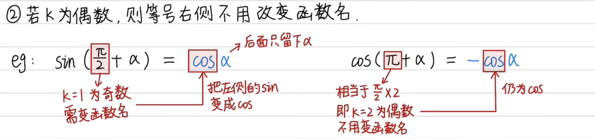
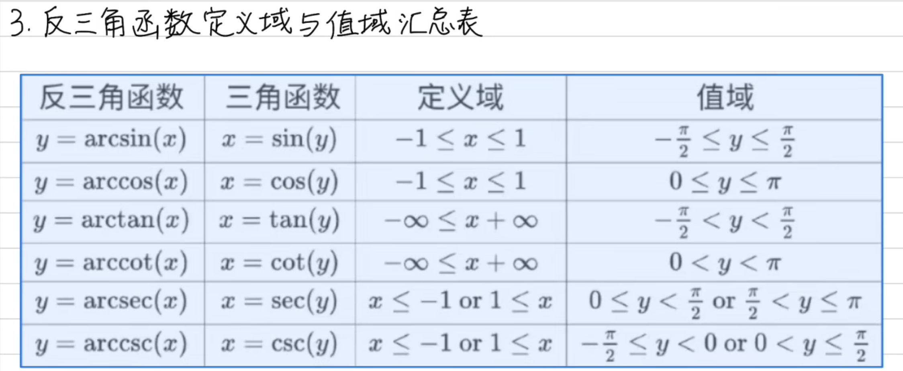
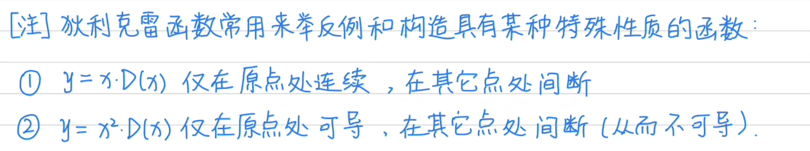

# 初等函数

[bilibili - 零基础学高数](https://space.bilibili.com/1846547207/channel/collectiondetail?sid=620098)

## 一、常数函数

## 二、幂函数

### 1. 常见幂函数

## 三、指数函数

## 四、对数函数

$$
反函数：y = a^x
$$

$$
a^{loga^x} = x
$$

$$
a^{loga^x} = x
$$

$$
e^{ln^x} = e^{loge^x} = x
$$

$$
不存在：ln(a+b) 和 ln(a-b)
$$

## 五、三角函数

### 1. 任意角的三角函数

               

### 2. 诱导公式

### 3. 和角公式 和 差角公式

### 4. 二倍角公式

### 5. 半角公式

### 6. 和差化积公式

### 7. 积化和差公式

## 六、反函数

### 1. 例题

## 七、 反三角函数

### 1. 概念

### 2. 图像

### 3. 定义域 与 值域

# 分段函数

## 一、绝对值函数

## 二、符号函数

## 三、取整函数

## 四、狄利克雷函数

# 函数

## 一、函数基础概念

## 二、函数定义域

